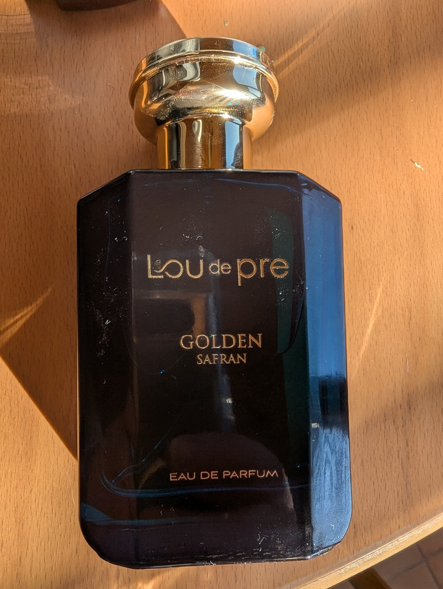

# Lou de Pre - Golden Safran
Bei diesem Duft scheiden sich leider die Geister...
Die einen finden ihn absolut super vom Geruch her, anspruchsvoll und challenging,
die anderen wiederum sagen er riecht absolut widerlich.
Es gibt wohl niemanden, der einfach so die Mitte nehmen würde. 
Der Duft polarisiert einfach.
Woran liegt das: Nun, in erster Linie natürlich an den Zutaten der Kopfnote -
man sagt ja nicht umsonst, dass der erste Eindruck entscheidend ist. Und bei diesem
Duft trifft einen der erste Eindruck leider wie eine Bombe.
Er riecht zuerst nach verbranntem Irgendwas. Sehr streng und wahnsinnig stichig.
Dann kommt sofort Lakritze und Co. zum Vorschein. Und da wird es bereits schwierig. Wer kein
Lakritze mag, ist nun spätestens raus aus der Verlosung.
Wartet man dann ein wenig ab, dann verfliegt das Ganze ein wenig und es kommt eine eher trockene,
würzige Note zum Vorschein, die allerdings immer noch sehr speziell ist und de nicht jedermanns Sache ist.
Wieder eine gute Weile später wird es dann leicht süsslich, allgemein kompatibel und angenenehm.
Bei uns zu Hause war jedoch der Eindruck eher schlecht. Um es mal einfach auszudrücken, aber die weibliche
Fraktion steht nunmal weder auf Lakritze noch auf Ouzo - Also ist der logischerweise direkt mal 
durchgefallen bei IHR. 
Bei mir hingegen hat mich der erste Eindruck auch gleich mal "weggehauen". Leider.
Ich hätte dann fast aufgegeben und das Handtuch geworfen, ihn abgewaschen und in die Tonne getreten.
Aber dann habe ich einfach mal ein wenig gewartet, den nächsten Tag ein bisschen weniger drauf gesprüht 
und das Ding mal etwas dezenter laufen lassen. Und was muss ich sagen: dann ging es besser.
Sicherlich: Der Duft ist nach wie vor leicht herausfordernd für die Geruchssinne. 
Aber er ist eins nicht: Langweilig und angepasst. Man muss sich auch leicht trauen, diesen Geruch aufzulegen.
Ich würde ihn aber keinesfalls vor einem Date, einem Meeting oder einem Essen verwenden. 
Dazu ist er einfach zu sehr dominant und es kann durchaus sein, dass man damit dem einem oder der anderen auf
die Füsse tritt und das muss man sich im Vorfeld gut überlegen.

